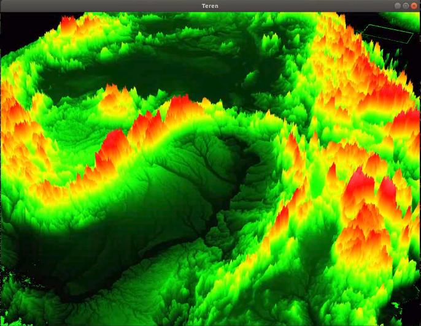

# Teren
Fast and accurate display of real terrain with OpenGL

## Build
* Makefile
* [OpenGL 3.3](https://www.opengl.org/) or later is required
* [GLEW](http://glew.sourceforge.net/) library is required

## Control
* TAB - switch map / earth view
* W, A, S, D - moving front / left / back / right
* mouse - looking around when in earth view
* scroll - zooming
* PAGEUP / PAGEDOWN - flying up / down in earth view
* ESC - close the program
* 0 - automatic LoD (Level of Details)
* (1 - 9) - manual LoD (1 for the best quality, 9 for the minimum quality)

## Results

#### Screenshot

#### YouTube video

